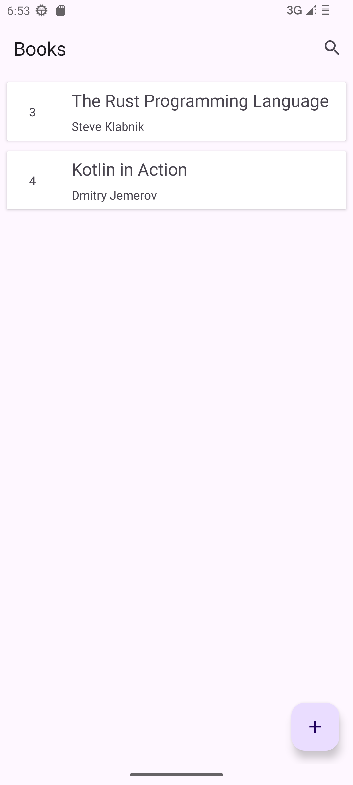

# BookManagementApp
An Android app for showing books, creating books, updating books and deleting books.

## Prerequisite
+ Android 12  

Tested on: 
  + Pixel 6(Android13, virtual)
  + Pixel 6(Android13, physical)
  + Pixel 5(Android14, physical)

## Preview
 
 
 

## Download
You can download the app from [release page](https://github.com/Chengming-Fan/BookManagement/releases)

## Dependencies
[SwipeRecyclerView](https://github.com/yanzhenjie/SwipeRecyclerView)

[MonthYearPickerDialog](https://github.com/Dzmitry-Lakisau/MonthYearPickerDialog)

[okhttp](https://github.com/square/okhttp)